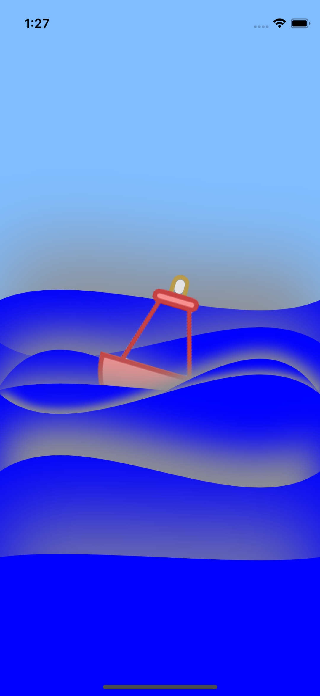
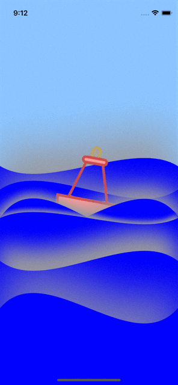
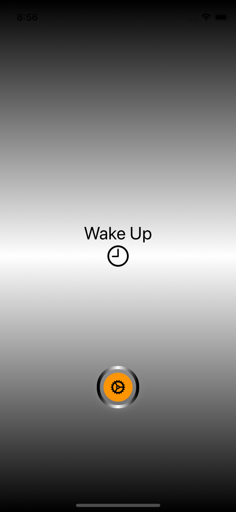

# SwiftUI Apps

'SwiftUI Apps' application that made with SwiftUI, which includes many sample applications, was made by Hamit Seyrek, the founder of the CodemVia community that on a voluntary basis. SwiftUI App has been developed using O'Reilly Media, Kavsoft and many other internet resources.

App | Info                                                                                                                                                            | Screenshots                                                                                                                                                            | Gif
---                                   |--- | ---                                                                                                                                       |---
**#[App 1](SwiftUIAnimationTutorials/Tutorials/GearsAndBelts)** | **Gears and Belts**  (animation)                                          |  |  | 
**#[App 2](SwiftUIAnimationTutorials/Tutorials/WifiLoading)** | **Wifi Loading**  (animation)                                          |  |  | 
**#[App 3](SwiftUIAnimationTutorials/Tutorials/LightSwitch)** | **Light Switch**  (animation)                                          |  |  | 
**#[App 4](SwiftUIAnimationTutorials/Tutorials/ExpandButton)** | **Expand Button**  (animation)                                          |  |  | 
**#[App 5](SwiftUIAnimationTutorials/Tutorials/WeatherGraphAnimation)** | **Weather Graph**  (animation)                                          |  |  | 
**#[App 6](SwiftUIAnimationTutorials/Tutorials/TwinklingStars)** | **Twinkling Stars**  (animation)                                          |  |  | 
**#[App 7](SwiftUIAnimationTutorials/Tutorials/Swinging)** | **Swinging Girl**  (animation)                                          |  |  | 
**#[App 8](SwiftUIAnimationTutorials/Tutorials/SlideCard)** | **Slide Card**  (animation)                                          |  |  | 
**#[App 9](SwiftUIAnimationTutorials/Tutorials/ElevatorApp)** | **Elevator App**  (animation)                                          |  |  | 
**#[App 10](SwiftUIAnimationTutorials/Tutorials/ParallaxEffext)** | **Parallax Effect**  (animation)                                          |  |  | 
**#[App 11](SwiftUIAnimationTutorials/Tutorials/Wawes)** | **Wawes**  (animation)                                          |  |  | 
**#[App 12](SwiftUIAnimationTutorials/Tutorials/FlyPresentDismissTransition)** | **Fly And Dismiss**  (animation)                                          |  |  | 

